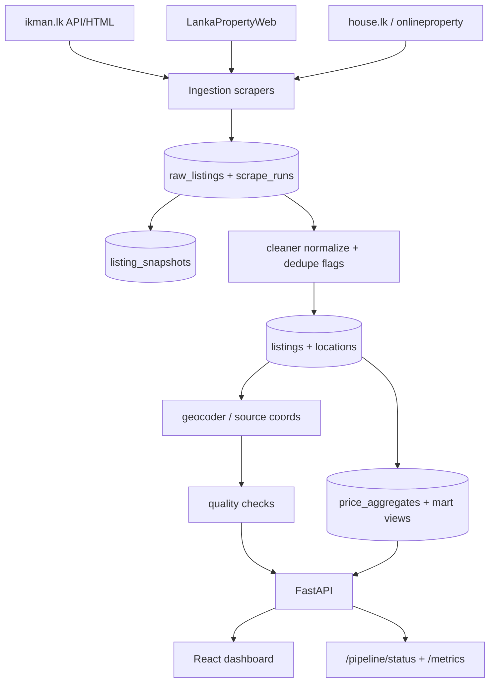

# PropertyLK — Sri Lanka property listing data platform

Multi-source scrape → clean → geocode → quality checks → market marts → API

**Live app:** [propertylk-one.vercel.app](https://propertylk-one.vercel.app/)  
**API:** Lambda Function URL in `vercel.json` (`VITE_API_URL`) — try `/health`, `/pipeline/status`, `/pipeline/metrics`

[](https://github.com/ArdenoStudio/sri-lanka-property-price-intelligence-platform/actions/workflows/ci.yml)

## Problem

Sri Lanka property portals publish listing prices in incompatible formats, with weak history and no shared quality layer. PropertyLK ingests multiple public sources on a schedule, normalizes them into a canonical Postgres schema, and exposes freshness-aware market analytics.

## Architecture



## Current production metrics

Snapshot from the live API on **2026-07-23** (`/health`, `/stats`, `/public/pipeline`). Rates that need warehouse scans ship on `/pipeline/metrics` after this branch deploys.

| Metric | Value | Source |
|---|---|---|
| Raw listings | **124,221** | `/health` |
| Canonical listings (post-clean upsert) | **102,864** | `/health` |
| Districts covered | **25** | `/stats` |
| Listings first-seen last 7 days | **11,904** | `/stats` |
| ikman cleaned rows | **59,099** | `/public/pipeline` |
| LPW cleaned rows | **18,631** | `/public/pipeline` |
| Last successful LPW scrape | **2026-07-22** | `/public/pipeline` |
| Last successful ikman scrape (as recorded) | **2026-06-22** — **delayed** | `/public/pipeline` |
| Cleaner last success | **2026-07-05** — delayed vs daily SLA | `/public/pipeline` |
| Geocode / aggregates jobs | OK as of 2026-07-22 | `/public/pipeline` |
| Duplicate rate / geocode success % | Computed live | `GET /pipeline/metrics` |

These numbers are not marketing targets — when a source is delayed, the status endpoint says so.

## Data sources

| Source | `source` key | Method | Typical cadence | Fragility |
|---|---|---|---|---|
| ikman.lk | `ikman` | Public API (preferred) / Playwright fallback | Daily GHA / catchup | CAPTCHA on HTML; SERP page wall ~500; unofficial API |
| LankaPropertyWeb | `lpw` | API token from site + HTML fallback | Daily | `secure_key` rotation; bot detection on browser path |
| house.lk | `lamudi` | Playwright | Secondary / catchup | Cloudflare fingerprinting |
| onlineproperty.lk | `onlineproperty` | HTML / WP REST probes | Secondary | WP endpoint permission drift |

Ethics & rate limits: [docs/source-apis/ETHICS.md](docs/source-apis/ETHICS.md). PDPA sanitization tests: `tests/test_pdpa_sanitization.py`.

## Pipeline stages → code

| Stage | Code |
|---|---|
| Scrape | `scraper/ikman_api.py`, `ikman.py`, `lpw_api.py`, `lpw.py`, `lamudi.py`, `onlineproperty.py` |
| Orchestration | `run_all_scrapers.py`, `_*_catchup_runner.py`, `.github/workflows/*scrape*`, `clean.yml`, `geocode.yml`, `aggregate.yml` |
| Normalize | `scraper/cleaner.py` · `run_clean.py` |
| History | `listing_snapshots` + `scraper/utils.py` fingerprint |
| Geocode | `scraper/geocoder.py` · `run_geocode.py` |
| Quality | `scraper/quality.py` · `GET /pipeline/quality` |
| Marts | `PriceAggregator` in `api/main.py` · views in `db/migrations/007_analytics_marts.sql` |
| API / UI | `api/main.py` · `dashboard/` |

## Data model (summary)

- **Raw** `raw_listings` unique `(source, source_id)` — idempotent re-ingest.
- **Canonical** `listings` same key; `first_seen_at` / `last_seen_at`; outlier + duplicate flags.
- **History** `listing_snapshots` on content fingerprint change.
- **Ops** `scrape_runs` (found/new/failed + optional `stats`), `job_runs`.
- **Marts** `price_aggregates` (+ bedroom buckets); SQL views `mart_*`.

Full field reference: [docs/DATA_MODEL.md](docs/DATA_MODEL.md). Platform map: [docs/DATA_PLATFORM.md](docs/DATA_PLATFORM.md).

## Data quality & freshness

- Freshness SLA per source in `scraper/quality.py` (ikman/LPW 36h, secondary 72h).
- Null rates on price / size / district; outlier guards; duplicate rate.
- Geocode success = share of listings with lat/lng; confidence `high|medium|low`.
- Surface: `/pipeline/status`, `/pipeline/metrics`, `/pipeline/quality`.

Methodology for medians, comps, deal scores: [docs/METHODOLOGY.md](docs/METHODOLOGY.md).

## Failure handling & backfills

See [docs/RUNBOOK.md](docs/RUNBOOK.md): source schema change, Nominatim limits, partial scrapes, `reprocess_data.py` / `run_clean.py` / `run_geocode.py` / `run_aggregate.py`.

## Tests & CI

```bash
pip install pytest sqlalchemy structlog httpx beautifulsoup4
pytest tests/ -v
```

CI workflow [ci.yml](.github/workflows/ci.yml) runs Python tests + dashboard `tsc` on pull requests. Scrape workflows are intentionally separate.

## Local run

```bash
cp .env.example .env   # DATABASE_URL, NOMINATIM_USER_AGENT, ADMIN_API_KEY, …
docker compose up -d db
pip install -r requirements.txt
# apply db/migrations/001–007
uvicorn api.main:app --reload --port 8080
cd dashboard && npm ci && npm run dev
```

Pipeline locally:

```bash
python _ikman_catchup_runner.py   # or LPW / house.lk runners
python run_clean.py && python run_geocode.py && python run_aggregate.py
# or: python _process_runner.py
```

## Known limitations

- Cross-source dedupe is a soft heuristic, not address-level entity resolution.
- Unofficial portal APIs can change without notice; house.lk remains Cloudflare-fragile.
- ikman scrape freshness can lag when catchup jobs fail — status endpoint is the source of truth.
- Deal score is relative to medians, not an appraisal model.
- No Kafka/Spark/Iceberg — daily batch volume does not justify that stack.

## Case study

What broke, what we fixed, tradeoffs, and a sober 10× scale note: **[docs/CASE_STUDY.md](docs/CASE_STUDY.md)**.
