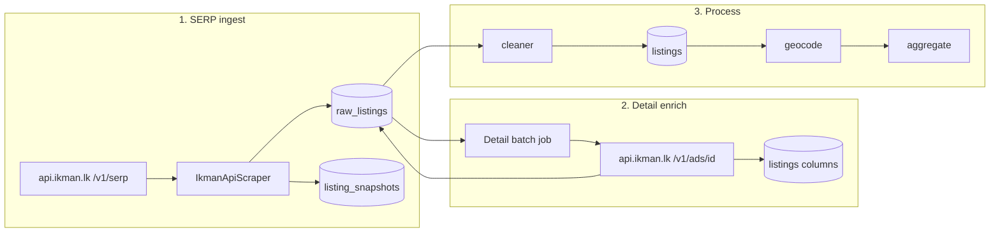

# Plan: Full ikman inventory in Postgres (SERP + detail fields)

**Goal:** Every active ikman property listing lands in our DB with the fields we can pull from SERP and detail — and stays fresh via daily incremental runs.

**Scope:** Active inventory only (~65k ads today). ikman is not a multi-year archive; history comes from our snapshots over time.

---

## Target data model (what “properly” means)

| Field | Source | Store where | Status today |
|-------|--------|-------------|--------------|
| `source_id` (hex) | SERP `id` | `raw_listings` / `listings` | ✅ |
| title, url, price, location, category → type | SERP | columns + `raw_json` | ✅ |
| beds / baths | SERP `details[]` + detail `properties` | `listings.bedrooms/bathrooms` via cleaner | ⚠️ SERP → `raw_json` only until clean |
| size (sqft / perches) | SERP hint + detail `size`/`house_size`/`land_size` | `listings.size_*` | ⚠️ often needs detail |
| description | detail | `raw_listings.description` | ⚠️ only if enricher runs |
| view count | detail `statistics.views` | **new** `listings.view_count` or `raw_json.views` | ❌ dropped today |
| images | SERP `images[]` | **new** `raw_json.images` (URLs only) | ❌ not mapped |
| listing activity date | SERP `date` | `raw_json.date` + optional `listings.source_updated_at` | ⚠️ in `raw_json` only |
| first / last seen | our scrape clock | `listings.first_seen_at` / `last_seen_at` | ✅ after clean |

PII rule unchanged: sanitize `contact_card`; never persist phones/names.

---

## Architecture (target pipeline)



**Principle:** SERP is the source of truth for *which ads exist*. Detail fills gaps (description, structured size, views). Cleaner materializes typed columns. Snapshots record price/content changes over time.

---

## Phase 0 — Preconditions (already in flight)

PR #59 / `cursor/ikman-api-enable-0458`:

- [x] Live API confirmed working
- [x] `run_all_scrapers` honors `USE_IKMAN_SERP_API`
- [x] Daily/mega workflows set API flags
- [x] Comma size parse fix (`1,816 sqft` → 1816)

---

## Phase 1 — Complete SERP field capture

**Why:** We already hit the API but drop images and underuse `date`.

1. **Map images into `raw_json`** in `map_ikman_serp_result`
   - Store URL list only (e.g. `raw_json.image_urls[]`)
   - Cap at N (e.g. 10) to keep row size sane
2. **Keep activity date** as `raw_json.date` / `raw_json.last_bump_up_date` (already partially there)
3. Optional column later: `listings.source_updated_at` for sorting/filters without JSON digs
4. Unit tests against `docs/source-apis/ikman/samples/serp_property.json`

**Exit:** New SERP rows always include beds/baths in `raw_json`, image URLs, and activity date.

---

## Phase 2 — Full SERP backfill (get all ~65k IDs in DB)

**Why:** Daily caps (~75 pages/category) and stop-on-dupes cannot cold-load the catalog. Land alone is ~32k ads (~1.2k pages).

### 2a. Cold-start / catch-up job

New workflow (or mega mode): `ikman_full_serp.yml` / `workflow_dispatch`

| Setting | Value | Rationale |
|---------|-------|-----------|
| `USE_IKMAN_SERP_API` | `1` | JSON path only |
| `IKMAN_API_MAX_PAGES` | `0` (uncapped) | walk until empty / API 500 |
| `IKMAN_API_STOP_AFTER_DUP_PAGES` | `999` on cold start, `3` on daily | cold start must not early-exit |
| `IKMAN_API_DELAY_SECONDS` | `0.35–0.5` | polite; ~2–3k pages total |
| Categories | expand DEFAULT | see 2b |
| Timeout | 6h+ or shard by category | Actions 240–360m may be tight |

**Shard strategy (recommended):** one job matrix per category (`415`, `942`, …) so land does not starve houses if a run times out.

Rough volume:

| Category | ~ads | ~pages @ 26/page |
|----------|------|------------------|
| 415 houses sale | 19k | ~740 |
| 942 land sale | 32k | ~1230 |
| 937 apt sale | 3k | ~120 |
| rent + commercial | ~12k | ~460 |
| **Total** | **~65k** | **~2.5k pages** |

At 0.4s delay ≈ **15–25 minutes of pure HTTP** plus DB upserts — fine if uncapped and not killed by dup-stop.

### 2b. Category completeness

Add to `DEFAULT_CATEGORIES` (or env `IKMAN_API_CATEGORIES`):

- `413` Room & Annex Rentals
- `943` Land Rentals  
- Optionally exclude `936` short-term (already skipped by flag/logic)

Do **not** scrape root `409` if subcats already cover — avoids duplicates.

### 2c. Daily incremental (after catch-up)

Keep daily at **80–100 pages/category** + `STOP_AFTER_DUP_PAGES=3`:

- New/bumped ads appear on early pages
- Dup-stop ends walk once we overlap existing inventory
- Weekly “deep” pass (200–400 pages/category) to catch quiet long-tail

### 2d. Identity

Keep `bridge_ikman_identity` before each SERP run (raise limit from 2000 → all non-hex if backlog exists). Canonical key = 24-char hex.

**Exit:** `SELECT count(*) FROM raw_listings WHERE source='ikman'` ≈ ikman property total (± churn). Dashboard/ops metric: `ikman_raw_count` vs `serp pagination.total` for category 409.

---

## Phase 3 — Detail enrichment for every listing that needs it

**Why:** Description, structured size, and views only exist on `/v1/ads/{id}`. Flag is on in CI but **no job runs the enricher**; default cap is **200/run**.

### 3a. Persist detail fields properly

In `map_ikman_ad_detail` + enricher write path:

| Field | Action |
|-------|--------|
| bedrooms / bathrooms / size_* | Continue writing to `Listing` |
| description | Write to `RawListing.description` (overwrite if fuller) |
| views | Persist `raw_json.views` and/or new `listings.view_count` |
| properties blob | Keep sanitized subset in `raw_json.properties` |

Migration (small):

```sql
ALTER TABLE listings ADD COLUMN IF NOT EXISTS view_count INTEGER;
-- optional:
-- ALTER TABLE listings ADD COLUMN IF NOT EXISTS source_updated_at TIMESTAMPTZ;
```

### 3b. Bulk detail backfill job

New script/job: `scripts/backfill_ikman_detail.py` (or extend `DetailEnricher`)

Rules:

1. Select ikman listings where detail missing:  
   `description IS NULL` OR `size_* IS NULL` OR (house/apt AND bedrooms IS NULL) OR `view_count IS NULL`
2. Prefer rows never attempted; allow **retry** when `enrichment_attempted_at` is old and fields still null (fix one-shot stamp)
3. Throughput: `ENRICHER_MAX_PER_RUN=2000` (or matrix shards of 5k IDs)
4. Delay ~0.3–0.5s → ~65k details ≈ **6–10 hours** total → run as multi-day GHA or self-hosted overnight
5. On HTTP 429/5xx: backoff, do **not** stamp attempted (so retry works)

### 3c. Wire into GitHub Actions

| Job | When | What |
|-----|------|------|
| `daily_scrape` | nightly | SERP incremental only |
| `ikman_detail_enrich` | nightly after clean (or parallel after SERP) | enrich N=2k–5k |
| `ikman_full_serp` | manual / weekly | uncapped SERP catch-up |
| `ikman_detail_backfill` | manual until backlog ~0 | high-cap detail |

**Exit:** >95% of house/apt rows have bedrooms; >80% have size where ikman publishes it; descriptions present for enriched set; views stored when API returns them.

---

## Phase 4 — Clean → geocode → aggregate stays the product path

Order for “complete” nights:

1. SERP incremental  
2. Cleaner (`process_all` until drained) — reads `raw_json.bedrooms` / size  
3. Detail enrich (fills gaps on `listings` + description)  
4. Optional second clean pass for rows that gained size/beds from detail  
5. Geocode  
6. Aggregate  

Today mega pipeline does scrape → clean → geocode → aggregate and **skips enrich**. Add enrich between clean and geocode (or after geocode if location not needed for enrich).

**Exit:** Listings table is what the dashboard reads; raw_json remains audit/debug.

---

## Phase 5 — Freshness, monitoring, and “all listings” definition

### Definition of done

A listing is **complete** when:

- In `raw_listings` + cleaned `listings` with hex `source_id`
- Has price + location string
- Has beds/baths if property type is house/apartment and ikman published them
- Has size if ikman published size/land_size/house_size
- Has description if detail succeeded
- Has `view_count` if detail returned statistics
- Has ≥1 image URL in `raw_json` when SERP provided images
- `last_seen_at` updated within the last successful SERP window that included it

### Ops metrics (PipelineStatus / SQL)

- `ikman_serp_total` (from API pagination.total for 409 or sum of subcats)
- `ikman_raw_count` / `ikman_listing_count`
- `ikman_missing_beds` / `ikman_missing_size` / `ikman_missing_description`
- `ikman_enrich_backlog` (`enrichment_attempted_at IS NULL` or incomplete)
- `ikman_last_serp_at` / `ikman_last_enrich_at`

### Churn

Ads deactivate; we do not get a “deleted” feed. Options:

1. Soft: if not seen in SERP for N days → `listings.is_active=false` (requires new flag or reuse existing)
2. Hard delete: avoid; keep for history via snapshots

---

## Suggested implementation order

| Step | Work | Risk |
|------|------|------|
| 1 | Merge API enablement (#59) | Low |
| 2 | SERP mapper: images + confirm beds/date in `raw_json` | Low |
| 3 | Category list + uncapped catch-up workflow (matrix by category) | Med (timeouts/500s) |
| 4 | Persist views; enricher retry semantics | Low |
| 5 | Nightly detail job + manual backfill until backlog clear | Med (runtime) |
| 6 | Pipeline: scrape → clean → enrich → geocode → aggregate | Low |
| 7 | Metrics + active-flag for unseen ads | Low |

---

## What we will *not* get from ikman alone

- Multi-year sold/removed history (only ~weeks–2 months of active `date`s)
- Guaranteed phone/email (PII — we deliberately strip)
- Perfect size/beds on every ad (sellers omit fields)
- Infinite deep pagination (API 500s ~page 600+)

Those gaps are filled by **our daily snapshots** and other sources (LPW, Land Registry, etc.), not by one giant ikman dump.

---

## Effort sketch (technical, not calendar)

- **Phase 1** — mapper + tests: small, localized to `ikman_api.py`
- **Phase 2** — workflow + category env + cold-start flags: medium; main risk is GHA timeout → shard by category
- **Phase 3** — enricher throughput + migration + retry: medium; largest wall-clock cost is ~65k detail GETs
- **Phase 4–5** — pipeline wiring + metrics: small once jobs exist

No new vendor dependency — only `api.ikman.lk` + Postgres + GitHub Actions.
